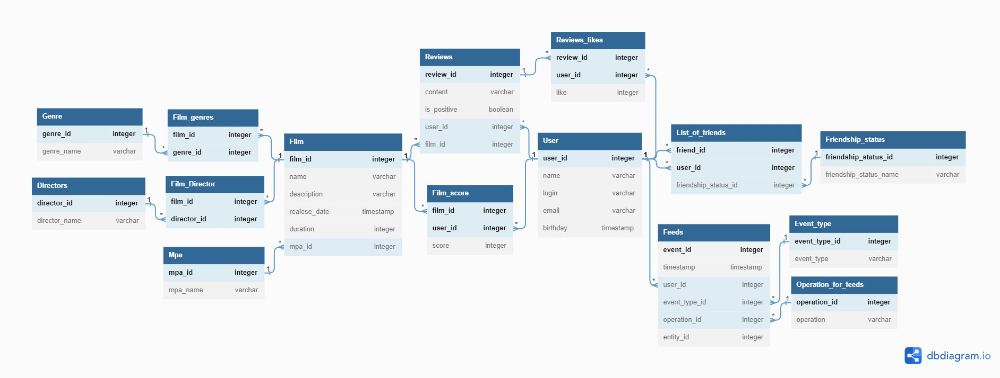

java-filmorate
Template repository for Filmorate project.

## Описание программы
Данный проект представляет собой бекенд веб-сервиса для работы с фильмами, пользователями и отзывами, а также для управления связями между ними. Основной целью этого проекта является предоставление пользователю возможности удобно и эффективно управлять информацией о фильмах, обмениваться отзывами и рекомендациями с другими пользователями, а также находить интересные фильмы на основе их предпочтений.

Сервис позволяет пользователям наслаждаться фильмами, обмениваться мнениями и рекомендациями, находить новые интересные фильмы и узнавать о последних событиях в кругу своих друзей.

## Технологии

- Spring Boot 
- Maven 
- JUnit 
- RESTful API 
- JDBC

## Запуск программы 
На текущий момент запуск программы происходит

- Клонируйте репозиторий проекта на свою локальную машину:  
```git clone git@github.com:GlazyrinAV/java-filmorate.git```

- Запустите командную строку и перейдите в корень директории с проектом.  

- Соберите проект  
```mvn clean package```

- запуск приложения  
```java -jar target/filmorate-0.0.1-SNAPSHOT.jar```

### Описание Базы данных проекта


## Film
Содержит информацию о фильме.

Первичный ключ - film_id.

Внешний ключ - rating_id, который связывает Film и Rating

## Rating
Содержит перечисление рейтингов фильмов.

Первичный ключ - rating_id

## Film_genres
Промежуточная таблица для декомпозиции связи многие - многие. Связывает фильмы и жанры.

Используется составной первичный ключ, который состоит из film_id и genre_id

Внешний ключ - genre_id

## Genre
Содержит перечисление жанров фильмов.

Первичный ключ - genre_id

## Film_likes
Промежуточная таблица для декомпозиции связи многие - многие. Связывает фильмы и пользователей, поставивших лайк.

Используется составной первичный ключ, который состоит из film_id и user_id

Внешний ключ - user_id

## User
Содержит информацию о пользователях.

Первичный ключ - user_id (он же внешний ключ для List_of_friends)

## List_of_friends
Содержит список друзей пользователя.

Используется составной первичный ключ, который состоит из user_id и friend_id

Внешний ключ - friendship_status_id

## Friendship_status
Содержит перечисление статусов дружбы.

Первичный ключ - friendship_status_id